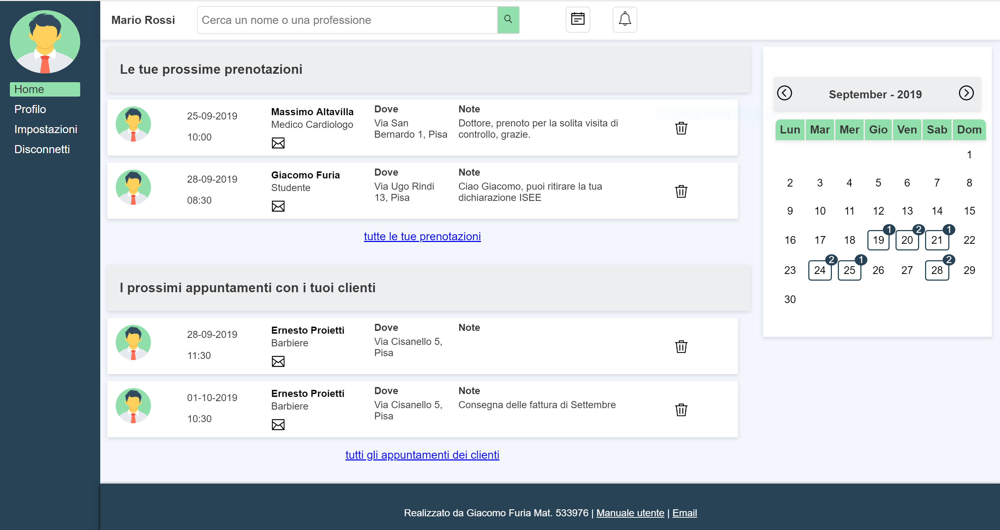
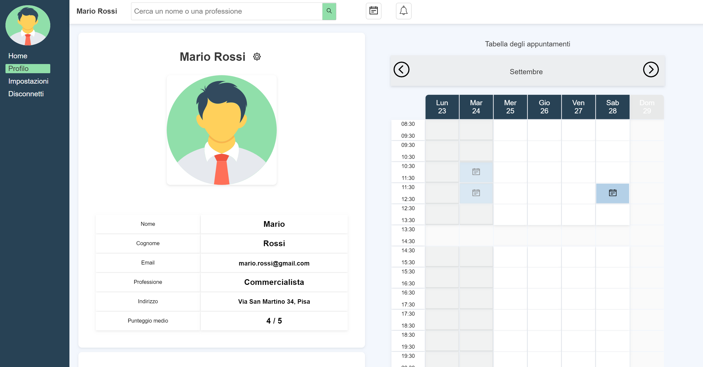

# Book My Appointment





# Book my appointments

Questo sito è rivolto a tutti gli utenti (clienti o liberi professionisti) che vogliono gestire online il calendario dei propri appuntamenti. Gli utenti, dopo essersi registrati possono cercare un altro utente, guardare sul suo calendario degli appuntamenti e prenotare un appuntamento disponibile nel giorno e nell'orario che preferiscono.


### Registrazione

Per registrarsi, l'utente deve cliccare sul tasto "Registrati" e fornire: nome, cognome, indirizzo email e password. Non è possibile che utenti diversi si registrino con lo stesso indirizzo email. Dopo la registrazione l'utente può accedere al sito utilizzando il suo indirizzo di posta elettronica e la sua password.


### Organizzazione

Tutte le pagine del sito sono formate da un menu laterale in cui sono presenti l'immagine del profilo dell'utente e dei link che permettono di navigare tra le pagine e da una barra di ricerca in cui l'utente può cercare gli altri utenti sia per nome che per professione.

### Ricerca

Mediante la barra di ricerca è possibile ricercare altri utenti tramite il loro nome, cognome o professione. I risultati più attinenti vengono mostrati nello spazio sottostante. Se l'utente non è soddisfatto di quei risultati può effettuare una ricerca più approfondita premendo il tasto invio della tastiera o cliccando sull'icona con la lente d'ingrandimento accanto alla barra di ricerca.


### Profilo

Ogni utente dopo la registrazione ha un profilo pubblico, visibile anche dagli altri utenti, in cui vengono riportati i propri dati e la propria tabella degli appuntamenti. Può modificare i dati in qualunque momento cliccando sull'icona con l'ingranaggio accanto al suo nome e salvando tutte le modifiche premendo sul tasto "Salva". Oltre a modificare i dati inseriti durante la registrazione può anche aggiungerne di nuovi come una sua foto profilo, il suo indirizzo e la sua professione.

### Tabella degli appuntamenti

Nella pagina del profillo inoltre è visibile la tabella degli appuntamenti dell'utente. Al momento della registrazione la tabella non è visibile poichè deve essere ancora configurata. L'utente può configurarla nella pagina "Impostazioni". In questa pagina inserisce i giorni lavorativi, gli orari di inizio e di fine, la durata degli appuntamenti e le eventuali pause. L'aspetto della tabella viene mostrato in tempo reale mediante l'anteprima sul lato destro della pagina.

### Prenotazione appuntamenti


Ogni utente per effettuare una prenotazione deve recarsi sul profilo dell'utente desiderato (ad esempio tramite la barra di ricerca) e selezionare l'appuntamento libero che preferisce nella tabella degli appuntamenti. Ogni casella rappresenta un appuntamento. Se è bianca significa che l'appuntamento è libero, se è grigia significa che non è prenotabile altrimenti se è blu con l'icona del calendario significa che è già stato prenotato. Tramite le frecce può scorrere avanti o indietro nel tempo ed effetuare delle prenotazioni anche nelle settimane successive a quella in cui si trova. Quando si clicca su una casella, si apre una schermata di conferma in cui vengono riepilogati i dati dell'appuntamento ed in cui è possibile aggiungere delle note personali. Cliccando sul tasto "conferma prenotazione" si conferma la prenotazione altrimenti si può annullare premendo sul tasto "Esci", cliccando fuori dal riquadro o premendo il tasto ESC della tastiera.

### Pagina home

Nella pagina "Home" vengono ricapitolati i primi tre appuntamenti più imminenti dell'utente suddivisi tra quelli che lui ha prenotato e quelli che sono stati prenotati da altri utenti con lui. In questa sezione l'utente può cancellare l'appuntamento cliccando sull'icona "Rimuovi" oppure può accedere alla lista completa degli appuntamenti cliccando sul link che si trova in fondo alla lista.


### Recensioni


Un utente che ha già effettuato degli appuntamenti con un altro utente può raccontare la sua esperienza (in modo da consigliare gli altri utenti) cliccando sul tasto "Scrivi una recensione". Sì aprirà una schermata in cui l'utente può dare un punteggio (da 1 a 5) e scrivere una sua opinione. Tutte le recensioni che un utente ha ricevuto ed il suo punteggio medio vengono mostrati nella sua pagina "Profilo".


### Calendario e notifiche

Ogni utente può visualizzare il calendario mensile cliccando sul tasto "Calendario"  in alto a destra. Nel calendario vengono evidenziati i giorni in cui l'utente ha degli appuntamenti. Per ogni giorno evidenziato è presente un badge che indica il numero totale di prenotazioni presenti. Cliccando su uno dei giorni si accede ad una pagina in cui vengono mostrati gli appuntamenti del giorno.

Ogni volta in cui un utente riceve una prenotazione, una recensione oppure un altro utente cancella un appuntamento con lui può restare aggiornato mediante le notifiche. Cliccando sul tasto "Notifica"  in alto a destra può vedere le ultime notiche ricevute.


### Amministrazione

Alcuni utenti del sito possono essere anche amministratori. Solo gli utenti amministratori possono accedere alla pagina "Admin" del sito in cui è possibile effettuare le seguenti operazioni di amministrazione:

*   Creare nuovi utenti
*   Modificare le informazioni di utenti già esistenti
*   Rimuovere delle recensioni offensive o non gradite
*   Rimuovere degli utenti dal sito

### Documentazione

## Modulo PHP

### `index.php`
La pagina index è la pagina iniziale del sito. Nella sezione di sinistra si trova il form di accesso o di registrazione mentre in quella di destra il manuale utente. I form vengono creati dalle funzioni presenti nel file `login.js` del modulo javascript.  
Al caricamento della pagina viene creata una nuova sessione e se l'utente ha già effettuato l'accesso, viene indirizzato alla sua pagina `home`.  La pagina interagisce con le funzioni dei file `login.js`, `effects.js` ed `validators.js` rispettivamente per la creazione dei moduli di accesso o registrazione, per gli effetti a scorrimento con cui appaiono i form e per la validazione lato client degli input.

### `login.php`
Questa pagina riceve tramite metodo POST i parametri 'email' e 'password' inviati tramite il form di login. Se uno dei due parametri non è stato inviato, indirizza automaticamente l'utente alla pagina `index` aggiungendo un messaggio di errore come parametro GET.
Se i due parametri sono stati ricevuti, viene creato un oggetto di classe User con l'email e la password ricevute e viene invocato su tale oggetto il metodo `login()`  che verifica se l'utente è registrato e se la password inserita è corretta. In caso non ci siano errori l'utente viene indirizzato alla sua pagina `home` altrimenti di nuovo alla pagina `index` con un messaggio di errore.

### `register.php`
Il compito di questa pagina è quello di ricevere, tramite metodo POST, i parametri di registrazione di un nuovo utente, verificarne la correttezza e mostrare un messaggio che informi l'utente se la registrazione è andata a buon fine o meno.
Se i parametri non sono stati ricevuti correttamente viene mostrato il seguente messaggio di errore:
> "C'è un problema nella tua registrazione, per favore inserisci tutti i campi del form."

Se invece la ricezione dei parametri avviene correttamente allora viene creato un nuovo oggetto di classe `User`, inizializzato con i parametri ricevuti e su tale oggetto viene invocato il metodo `register()` che si occupa di memorizzare l'utente nel database facendo ulteriori controlli e criptando la sua password.
### `home.php`
Le funzionalità di questa pagina sono:
* Mostrare le tre prenotazioni più imminenti dell'utente
* Mostrare i tre appuntamenti più vicini che l'utente ha fissato con i propri clienti
* Rimuovere una prenotazione passata come parametro GET

All'interno della pagina viene istanziato un oggetto della classe `Appointments` 
````php
$appuntamenti = new Appointments($_SESSION['userId']);
````
in cui vengono inseriti i dati necessari:
````php
$appuntamenti->getBookedAppointments(3,true,"ASC");
$appuntamenti->getReceivedAppointments(3,true,"ASC");
````
All'interno del corpo della pagina, vengono visualizzati gli appuntamenti mediante l'uso del metodo `stampaAppuntamenti()` ed il calendario attraverso le istruzioni:
````php
include './layout/calendar.php';
$calendar = new Calendar();
$calendar->show();
````
### `profilo.php`
All'interno di questa pagina l'utente può:
* Visualizzare il proprio profilo, modificare le proprie informazioni e visualizzare la propria tabella degli appuntamenti.
* Visualizzare il profilo di un altro utente, prenotare un appuntamento e lasciare delle recensioni.

Per implementare queste funzionalità la pagina interagisce con i file `User`, `AppointmentTable` e `Notify` del modulo php e con `profile`,`effects`,`validators` e `appointmentTable` del modulo javascript.

Come prima cosa viene creato un oggetto di classe `User` inizializzato con le informazioni dell'utente che ha effettuato il login o con quelle dell'utente che è stato passato come parametro GET.
````php
$userInfo = new User();
if(isset($_GET['user'])){
	$userInfo->getUserInfo($_GET['user']);
}else{
	$userInfo->getUserInfo($_SESSION['userId']);
}
````
Le funzioni `parametriProfiloRicevuti()`,  `parametriAppuntamentoRicevuti()` e `parametriRecensioneRicevuti()` permettono di verificare se sono stati ricevuti i parametri di salvataggio di un nuovo appuntamento, di modifica del profilo utente o di inserimento di una nuova recensione.  

La gestione delle recensioni viene realizzata dalla funzione `getReviews()` che preleva le recensioni di un utente e da `saveNewReview()`  che salva nel database una nuova recensione.

La prenotazione di nuovi appuntamenti invece viene implementata attraverso la classe `AppointmentTable` che si occupa della visualizzazione della tabella degli appuntamenti e tramite le funzioni `loadConfig()` (che preleva la configurazione della tabella degli appuntamenti di un utente) e `saveAppointment()`  salva nel database un nuovo appuntamento.
### `settings.php`
Questa pagina si occupa della configurazione e visualizzazione della tabella degli appuntamenti di un utente.  
La gestione della configurazione è realizzata attraverso le funzioni: 
`parametriRicevuti()` che verifica se sono stati ricevuti attraverso il metodo POST dei nuovi parametri di configurazione, `loadConfig()` che carica (se presente) la vecchia configurazione della tabella e `saveConfig()` che si occupa di salvare nel database la nuova configurazione. 

L'utente può vedere in tempo reale l'aspetto della sua tabella degli appuntamenti mediante la tabella di anteprima che viene realizzata dalla classe `PreviewTable` del modulo javascript.

### `search.php`
All'interno di questa pagina l'utente può ricercare altri utenti del sito inserendo il loro nome, cognome o professione (anche in modo parziale).
La ricerca viene realizzata principalmente dalle funzioni `searchUsers()` che effettua la ricerca nel database e restituisce il risultato della query e `printSearchResult()` che prende come parametro il risultato della prima funzione e mostra all'utente una lista cliccabile di utenti.
### `admin.php`
Per realizzare le sue funzionalità questa pagina interagisce con la classe `User` del modulo php, con le funzioni presenti nel file `TopBar.js` per la ricerca in tempo reale degli utenti e con quelle presenti in `admin.js` per la visualizzazione e rimozione dei form a comparsa. 

Per prima cosa nella pagina viene creato un oggetto della classe `User` e vengono chiamati i metodi che permettono di ricevere nuovi parametri e salvarli nel database come mostrato di seguito:
````php
$userInfo = new User();
if($userInfo->receiveProfileParameters()){
	$userInfo->updateUserSettings();
}
if($userInfo->receiveNewUserParameters()){
	$userInfo->addNewUser();
}
if(isset($_GET['delReview'])){
	$id = $_GET['delReview'];
	deleteUserReview($id);
}
if(isset($_GET['removeUser'])){
	$userInfo->userId=$_GET['removeUser'];
	echo "Result: ".$userInfo->removeUser();
}
````
### `myAppointments.php`
Permette di visualizzare tutti gli appuntamenti prenotati da un utente e di rimuovere gli appuntamenti selezionati dall'utente.
Per farlo crea un'istanza della classe `Appointments` e la inizializza con tutti gli appuntamenti dell'utente dal più recente a quello più vecchio nel tempo
````php
$appuntamenti = new Appointments($_SESSION['userId']);
$appuntamenti->getBookedAppointments(0,false,"DESC");
````
Per quanto riguarda la visualizzazione invece:
````php
$appuntamenti->stampaAppuntamenti("to","myAppointments.php");
````
### `clientsAppointments.php`
Permette di visualizzare tutti gli appuntamenti prenotati dai clienti dell'utente e di rimuovere gli appuntamenti selezionati.
Per farlo crea un istanza della classe `Appointments` e la inizializza con tutti gli appuntamenti dei clienti dal più recente a quello più vecchio nel tempo
````php
$appuntamenti = new Appointments($_SESSION['userId']);
$appuntamenti->getReceivedAppointments(0,false,"DESC");
````
e per quanto riguarda la visualizzazione:
````php
$appuntamenti->stampaAppuntamenti("from","clientsAppointments.php");
````
### `appointmentsViewer.php`
Questa pagina consente di visualizzare gli appuntamenti di un utente (sia quelli prenotati che quelli dei propri clienti) in un intervallo di date (la data di arrivo è esclusa).

Per implementare questa funzionalità crea un oggetto di classe `Appointments` e riceve la data di inizio e fine intervallo come parametri GET come mostrato di seguito:
````php
$appuntamenti = new Appointments($_SESSION['userId']);
if(isset($_GET['from']) && isset($_GET['to'])){
	$dataInizio = date('Y-m-d H:i:s',strtotime($_GET['from']));
	$dataFine = date('Y-m-d H:i:s',strtotime($_GET['to']));
	$appuntamenti->getBookedAppointments(0,false,"DESC",$dataInizio,$dataFine);
	$appuntamenti->getReceivedAppointments(0,false,"DESC",$dataInizio,$dataFine);
}
````
### `config.php`
All'interno di questo file vengono definite le due costanti `DIR_BASE` e `DIR_UTIL` che vengono utilizzate per facilitare l'inclusione di alcuni file nel progetto
````php
define("DIR_BASE",__DIR__."/");
define("DIR_UTIL", DIR_BASE."util/");
````
### `logout.php`
Questa pagina viene richiamata quando l'utente si vuole disconnettere dal sito. Elimina i parametri memorizzati all'interno della variabile `$_SESSION` e indirizza l'utente alla pagina `index`.
````php
session_start();
session_destroy();
header("Location: ./../index.php");
exit;
````
### `layout/AppointmentTable.php`
Questo file contiene la definizione della classe `AppointmentTable` che costruisce la tabella degli appuntamenti di un utente e la mostra tramite il metodo `show()`.
### `layout/calendar.php`
Contiene la definizione della classe Calendar che costruisce e visualizza un calendario mensile in cui per ogni giorno del mese viene visualizzato un badge contenente il numero degli appuntamenti presenti in quel giorno. Il metodo principale è il metodo `show()` che permette di visualizzare il calendario all'interno della pagina web.
### `layout/menu.php`
All'interno di questo file è definita la struttura e le funzioni della barra del menu che viene visualizzata sul lato sinistro di ogni pagina del sito. All'interno di questa pagina è definita la funzione `getProfileImage($utente)` che preleva dal database l'immagine del profilo di un utente e ne restituisce il percorso.
### `layout/top_bar.php`
Questa pagina contiene il layout della barra che si trova nella parte alta di ogni pagina del sito web. Al suo interno mostra il nome ed il cognome dell'utente che ha effettuato l'accesso, la barra di ricerca e i pulsanti che permettono di far comparire il calendario e le notifiche. Per implementare la ricerca degli utenti in tempo reale interagisce con le funzioni del file `AjaxManager` del modulo javascript.

### `util/Appointments.php`
Questa classe consente di gestire un insieme di appuntamenti (sia prenotati che ricevuti) da un utente. Per farlo definisce i metodi:
````php
getBookedAppointments($limit, $new, $order,$dataInizio=null,$dataFine=null){}
````
````php
getReceivedAppointments($limit, $new, $order,$dataInizio=null,$dataFine=null){}
````
che permettono rispettivamente di prelevare degli appuntamenti all'interno di un'intervallo di date. Il parametro `$limit` indica il numero massimo di appuntamenti, se uguale `0` equivale a dire "tutti gli appuntamenti". Il parametro `$new` è booleano e se settato, specifica di prelevare solo gli appuntamenti che si devono ancora svolgere. Il parametro `$order` può contenere il valore `"ASC"`oppure `"DESC"` e specifica se l'ordine deve essere dall'appuntamento più vecchio a quello più nuovo o viceversa. Se `$dataInizio` e `$dataFine` non vengono settati la funzione preleva tutti gli appuntamenti presenti nel database che rispettano le caratteristiche richieste dagli altri  parametri.

Inoltre è definito il metodo
````php
deleteAppointment($id){}
````
che permette di rimuovere un appuntamento verificando prima se l'utente che lo invoca è uno dei due utenti coinvolti.
### `util/BMADbManager.php`
All'interno della classe BMADbManager sono state definiti i metodi per la gestione delle connessioni con il database e per l'esecuzione delle query, ad esempio:
````php
openConnection(){}
````
apre una connessione con il database prelevando le informazioni di accesso dal file `dbConfig.php` oppure
````php
performQuery($queryText){}
````
che esegue una query sul database restituendo il risultato.
### `util/Notify.php`
Un oggetto di questa classe rappresenta una notifica che si vuole inviare a qualche utente dopo aver effettuato una determinata azione che lo coinvolge.
Per creare ed inviare una notifica ad un utente è necessario prima definirla
````php
Notify($idDestinatario, $testo,$letta){}
````
e poi invocare il metodo `send()`.
### `util/User.php`
La classe User consente di memorizzare e gestire le informazioni di un utente all'interno del sito. Le sue funzioni principali sono:
````php
login(){}
````
che verifica se l'utente è registrato e le credenziali inserite sono corrette altrimenti restituisce un messaggio di errore.
````php
register(){}
````
Memorizza l'utente all'interno del database effettuando i dovuti controlli. In caso di errore restituisce un messaggio di errore.
````php
getUserInfo($userId){}
````
Preleva dal database le informazioni relative all'utente passato come parametro e le inserisce nei rispettivi attributi della classe.
````php
updateUserSettings(){}
````
Aggiorna le informazioni dell'utente nel database sincronizzandole con quelle presenti negli attributi dell'oggetto.
````php
addNewUser(){}
````
Aggiunge al database un nuovo utente con le informazioni che sono salvate negli attributi dell'oggetto su cui è invocato (viene invocata dalla pagina di amministrazione).
````php
removeUser(){}
````
Rimuove dal database l'utente le cui informazioni coincidono con quelle contenute negli attributi dell'oggetto.

All'interno del file sono definite anche le funzioni `validateName($name)` e `validateEmail($email)` che consentono di validare rispettivamente dei nomi di persona e degli indirizzi email.
### `ajax/AjaxRenspose.php`
All'interno di questo file viene definita la classe `AjaxResponse` che rappresenta l'oggetto che viene codificato ed inviato dal server al client durante una richiesta ajax. Ogni oggetto di questa classe è formato da tre attributi:
````php
public $responseCode; // 0 tutto ok - 1 ci sono degli errori - -1 ci sono dei warning
public $message; // contenuto del messaggio di risposta
public $data; // dati di risposta
````
e viene creato chiamando il costruttore della classe:
````php
function AjaxResponse($responseCode, $message, $data=null)
````
### `ajax/userFinder.php`
Questa pagina viene richiamata dal modulo javascript che si occupa della ricerca degli utenti in tempo reale. Ogni volta che riceve una richiesta tramite metodo GET, chiama la funzione `searchUsers()` e mediante la funzione `setResponse()` inserisce i risultati di ricerca all'interno di un oggetto di classe `AjaxResponse()` ed invia la risposta codificata in formato json al client attraverso l'istruzione:
````php
echo json_encode($response);
````

Azioni analoghe avvengono nei file `ajax/reviewFinder.php` e `ajax/notificationFinder.php` che permettono di recuperare in modo asincrono rispettivamente le recensioni e le notifiche di un utente. 
## Modulo Javascript
### `admin.js`
Contiene le funzioni utilizzate dalla pagina `admin.php` per gestire gli eventi e far comparire e scomparire i form per le azioni di amministrazione. Queste funzioni sono: `open(elem){}`e `close(elem){}`.
### `ajaxManager.js`
Contiene le funzioni necessarie per eseguire delle richieste ajax `performAjaxRequest()` e per ricevere le risposte `getAjaxObject()`.
### `appointmentTable.js`
Questo file contiene le funzioni per la gestione degli eventi che accadono sulla tabella degli appuntamenti. In particolare la funzione `confirmAppointment()` viene invocata quando l'utente clicca su un appuntamento e visualizza una schermata di conferma mentre la funzione `closeConfirmAppointmentBox()` si occupa della chiusura di questa schermata.
### `effects.js`
Questo file contiene le funzioni che realizzano le animazioni all'interno delle pagine del siro, come lo scorrimento verso destra del form di login o quello verso l'alto del calendario.
### `login.js`
Contiene le funzioni per la creazione dei form di accesso e di registrazione `showSignFields()` e la funzione `checkPasswords()` che verifica l'uguaglianza tra le due password inserite in fase di registrazione.
### `PreviewTable.js`
Contiene la definizione della classe PreviewTable che si occupa della visualizzazione della tabella di preview ossia dell'anteprima della tabella degli appuntamenti che viene visualizzata nella pagina `Impostazioni`. Le funzioni principali sono la `buildTable()` che costruisce inizialmente la tabella e la `updateTable()` che aggiorna la struttura della tabella con i nuovi parametri.
### `profile.js`
Contiene le funzioni che gestiscono alcuni eventi all'interno della pagina `profile`. In particolare gestisce la comparsa del form che permette di modificare le proprie informazioni e la comparsa del form che permette di recensire un utente.
### `settings.js`
All'interno di questo file avviene la gestione degli eventi di modifica dei campi del form con la configurazione della tabella degli appuntamenti.
Inoltre vi è definita la classe `TimePicker` che realizza un semplice form a scomparsa con cui selezionare le ore e i minuti.
### `TopBar.js`
Nel file vengono gestiti gli eventi legati alla barra che si trova nella parte superiore del sito, ad esempio: l'apparizione del calendario o quella della sezione notifiche. Inoltre è definita anche la classe `SearchBar` che viene utilizzata ogni volta in cui si vuole implementare un campo di ricerca in tempo reale.
### `validators.js`
All'interno di questo file sono definite le funzioni per la validazione lato client degli input: `validateName()` e `validateEmail()`.

